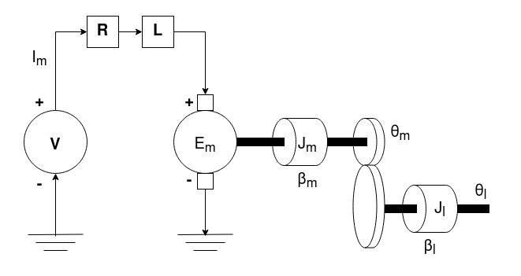
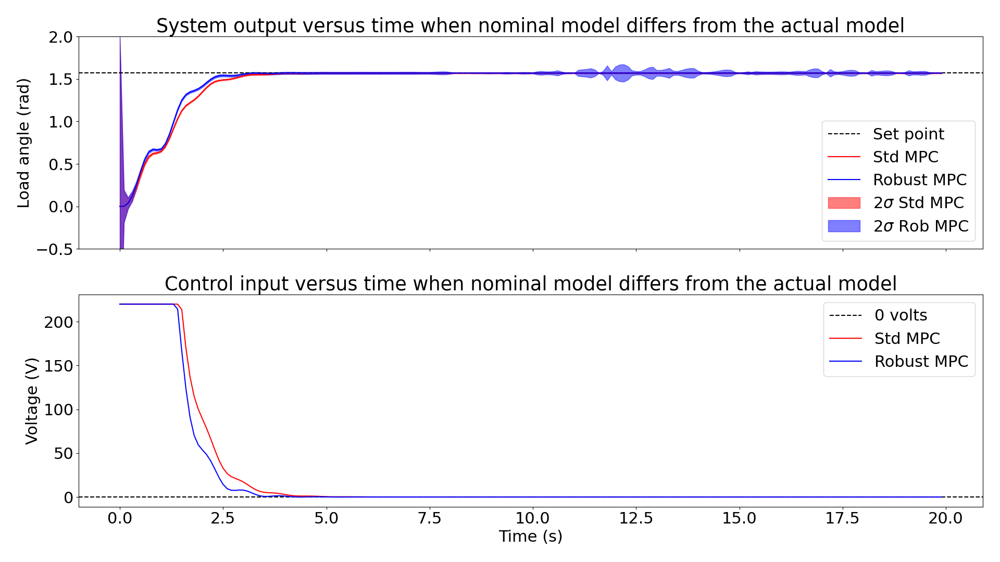

# Robust-MPC

## Description
This repository implements a C++ version of the robust unconstrained model predictive controller that considers modeling errors when trying to approximate a complex unknown system with a simple tractable known model. The main difference of this variant compared to a vanilla unconstrained model predictive controller is that it uses the robust Kalman filter that performs state estimation with the knowledge that the model we are working with is only an approximation. This state estimator accounts for modeling errors in its estimate. The two MPC algorithms were implemented in C++, and their performance was compared on a set-point tracking problem in a servo-mechanical system. The resulting data obtained was analyzed using Python.

**Diagram of the servo-mechanical system considered for set-point tracking:**



The complex non-linear dynamics and simple linear dynamics of this system can be found in [1].
  
## Getting Started

### Installing
```
  git clone https://github.com/Aaatresh/Robust-MPC
```

### Simulating the linear (simple) and non-linear complex dynamics
Run file ```python/sim_dyn_adv_model.py``` to visualize the simulations of the complex dynamics.

### Running the controllers on the simulated dynamics
- **Scenario considered: When the approximated linear dynamics (nominal) differs from the actual complex dynamics (More realistic scenario):** Run files ```standard_mpc_simulation.cpp``` and ```robust_mpc_simulation.cpp``` to compare the performance of the vanilla unconstrained MPC and the robust unconstrained MPC.

## Results
- Plots of the output and input (above and below, respectively) of the system when the approximated linear dynamics (nominal) differs from the actual complex dynamics:



## Authors
Contributors' names and contact info:
* Anirudh Aatresh (aaatresh@umich.edu)  


## License
This project is licensed under the GPL 3.0 License - see the LICENSE.md file for details.

## References
[1] [On the coupling of model predictive control and robust Kalman filtering](https://ietresearch.onlinelibrary.wiley.com/doi/epdf/10.1049/iet-cta.2017.1074).
